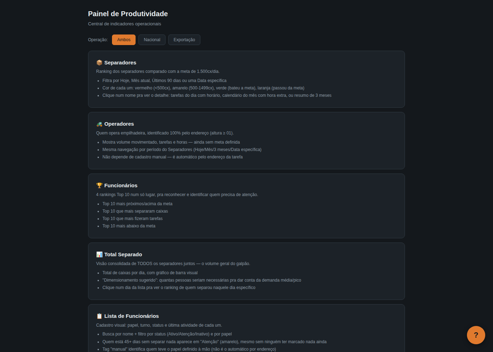
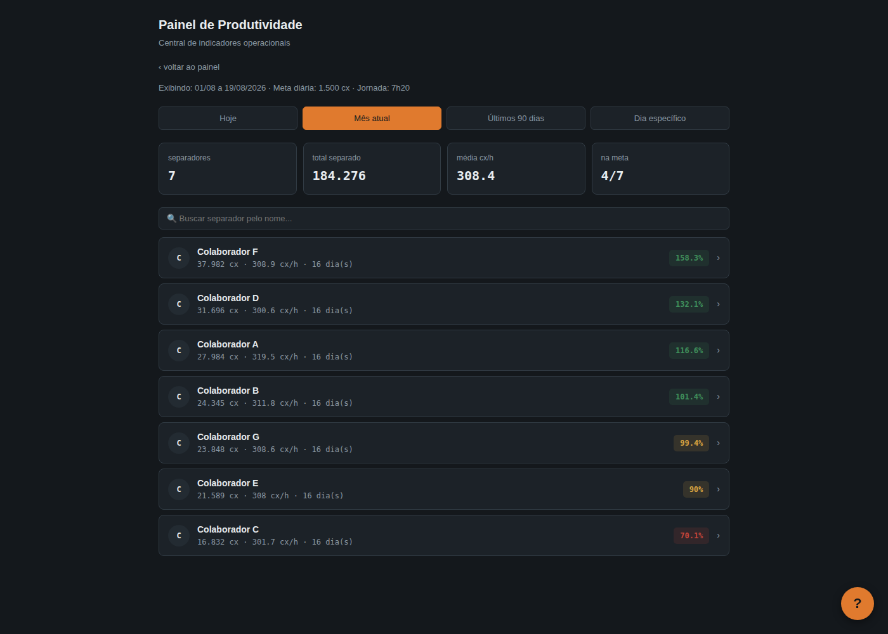
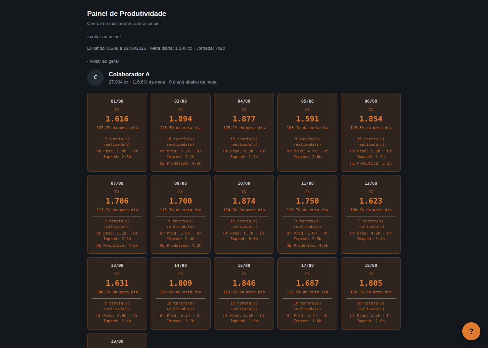
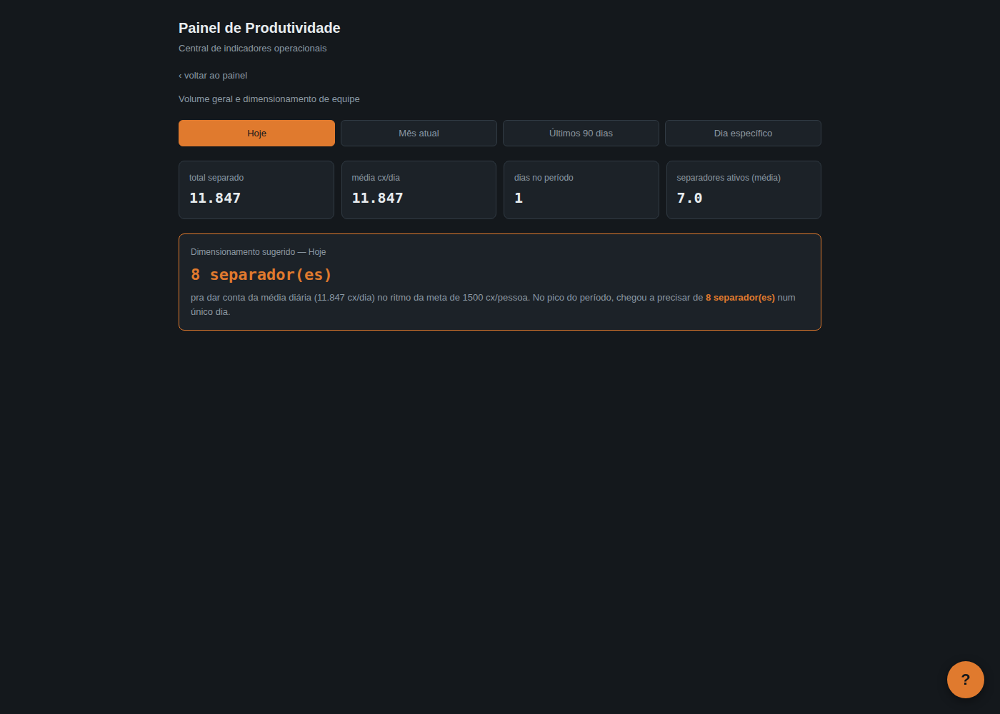
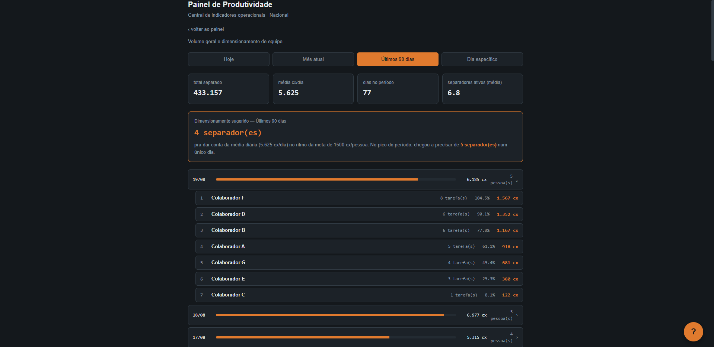
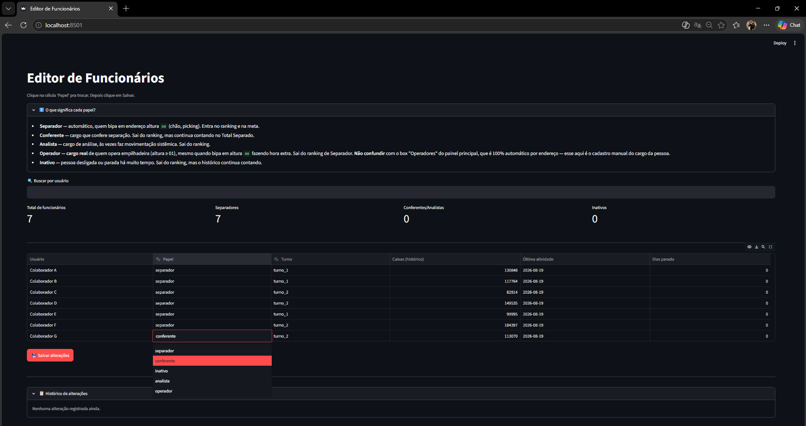

# 📦 Sistema de Produtividade de Separação (Picking)

Pipeline completo — da extração automatizada de dados de um sistema WMS até um dashboard interativo — construído para transformar exportações brutas em indicadores acionáveis de produtividade por colaborador.

> **Contexto:** projeto de estudo/portfólio em RPA e automação de processos, simulando um cenário real de operação logística. Nenhum dado real de pessoas, empresas ou sistemas é utilizado ou incluído neste repositório.

---

## 🎯 O problema que o projeto resolve

Em operações de separação (picking) de alto volume, medir produtividade individual "no olho" é impreciso e não escala. Este projeto automatiza todo o ciclo:

**Extração → Tratamento → Indicadores → Visualização → Governança**

O resultado permite que um gestor tenha, diariamente, uma visão clara de quem está performando acima/abaixo da meta — e o *porquê* (rota percorrida, tempo parado entre tarefas, hora extra), o que transforma uma conversa de feedback de "achismo" em decisão orientada por dado.

---

## 🏗️ Arquitetura

```
┌─────────────────────┐     ┌──────────────────────┐     ┌───────────────────────┐
│  exportar_wms_       │────▶│  tratamento_          │────▶│  indicadores_          │
│  produtividade.py    │     │  produtividade.py     │     │  produtividade.py      │
│  (Selenium)           │     │  (limpeza + regras)   │     │  (cálculo de métricas) │
└─────────────────────┘     └──────────────────────┘     └───────────┬───────────┘
                                                                        │
                                     ┌──────────────────────────────────┴───┐
                                     ▼                                      ▼
                          ┌──────────────────────┐          ┌──────────────────────────┐
                          │  gerar_painel_html.py │          │  editor_funcionarios.py   │
                          │  (dashboard interativo)│          │  (Streamlit, chave mestra) │
                          └──────────────────────┘          └──────────────────────────┘
```

**Camada de segurança** (usada pela extração automatizada):

```
env.env (texto puro, uso único)
        │  utils/criptografar_credenciais.py
        ▼
credenciais.enc  (AES-256-GCM + PBKDF2, 600k iterações)
        │  utils/env_ler.py
        ▼
credenciais em memória, nunca em disco
        │  (opcional, p/ execução agendada sem interação)
        ▼
utils/dpapi_util.py → Windows DPAPI (vincula a senha mestra à conta + máquina)
```

> O robô de extração (`exportar_wms_produtividade.py`) foi escrito para um sistema ERP/WMS genérico via Selenium. Nomes de sistema, URLs e variáveis de ambiente foram generalizados neste repositório público.

---

## 📁 Estrutura do repositório

```
produtividade-separacao/
├── src/
│   ├── scripts/            # pipeline principal (roda em sequência)
│   │   ├── exportar_wms_produtividade.py
│   │   ├── tratamento_produtividade.py
│   │   ├── indicadores_produtividade.py
│   │   ├── gerar_painel_html.py
│   │   ├── editor_funcionarios.py
│   │   └── gerar_base_exemplo.py
│   └── utils/               # utilitários de apoio (segurança/credenciais)
│       ├── criptografar_credenciais.py
│       ├── env_ler.py
│       └── dpapi_util.py
├── docs/                    # imagens do dashboard (README)
├── base/                    # dados gerados em tempo de execução (não versionado)
├── requirements.txt
├── LICENSE
└── README.md
```

---

## 🧩 Módulos

| Arquivo | Responsabilidade |
|---|---|
| `src/scripts/exportar_wms_produtividade.py` | Robô Selenium que autentica no WMS e exporta a extração bruta (.xls) sem intervenção manual |
| `src/scripts/tratamento_produtividade.py` | Limpeza, deduplicação e regras de negócio: agrupamento por tarefa, classificação separador/operador, tratamento de virada de turno |
| `src/scripts/indicadores_produtividade.py` | Cálculo de métricas por colaborador/dia: caixas separadas, cx/hora, % da meta, hora normal vs. extra, classificação (vermelho/amarelo/verde/estrela) |
| `src/scripts/gerar_painel_html.py` | Gera o dashboard HTML self-contained (sem backend) — visão geral em ranking + detalhe individual ao clicar |
| `src/scripts/editor_funcionarios.py` | Interface Streamlit para cadastro manual de papel/turno de cada colaborador, protegida por chave mestra, com log de auditoria completo |
| `src/scripts/gerar_base_exemplo.py` | Gera uma base 100% fictícia (nomes genéricos, números aleatórios) para testar o pipeline sem dados reais |
| `src/utils/criptografar_credenciais.py` | Criptografa credenciais de acesso ao WMS em AES-256-GCM, derivando a chave via PBKDF2 (nunca salva a chave em disco) |
| `src/utils/env_ler.py` | Descriptografa as credenciais na hora do uso; suporta execução manual (senha digitada) ou agendada (via DPAPI) |
| `src/utils/dpapi_util.py` | Wrapper do Windows DPAPI, usado apenas para viabilizar execução automática/agendada sem expor a senha mestra em texto puro |

---

## 🔐 Segurança desde o design

- **Zero credencial em texto puro persistente.** O arquivo `env.env` (usado só na configuração inicial) é excluído automaticamente após a criptografia.
- **AES-256-GCM** para as credenciais do sistema de origem, com chave derivada por **PBKDF2-HMAC-SHA256** (600.000 iterações — padrão OWASP 2023+), salt único por arquivo.
- **Windows DPAPI** como camada opcional para execução desatendida (agendador de tarefas): vincula a senha mestra à conta + máquina, sem precisar guardar a senha mestra em nenhum arquivo legível.
- **Chave mestra do editor manual** nunca é hardcoded — validada contra hash armazenado de forma segura, com toda alteração registrada em log de auditoria (`log_alteracoes.jsonl`), incluindo usuário, campo alterado, valor anterior e novo, com timestamp.

---

## 📊 Dashboard

- Arquivo HTML único, self-contained — abre em qualquer navegador, sem servidor, sem instalação.
- Visão geral: ranking dos colaboradores com % da meta, cx/hora médio, classificação por cor.
- Ao clicar em um nome: detalhe tarefa a tarefa, evolução da produtividade ao longo do turno, tempo parado entre tarefas.
- Busca com Fuse.js (busca fuzzy) para localizar rapidamente qualquer colaborador.
- Central de ajuda embutida, com busca em linguagem natural, pensada para quem vai usar o painel no dia a dia sem contexto técnico.

> 💡 **Quer navegar no dashboard de verdade, não só ver print?** Baixe este repositório (botão "Code" → "Download ZIP") e abra `painel_produtividade.html` direto no navegador — já vem com dados fictícios de exemplo, prontos para clicar e explorar.

> As imagens abaixo foram geradas a partir de `gerar_base_exemplo.py` — uma base 100% fictícia, com nomes genéricos e números aleatórios, incluída neste repositório só para ilustrar o resultado final. Nenhum dado real aparece aqui.

**Menu principal:**



**Ranking de separadores (mês atual):**



**Detalhe individual — calendário do mês, tarefas e horas produtivas/improdutivas:**



**Visão consolidada — volume total e dimensionamento sugerido de equipe:**



**Tendência ao longo do tempo — volume diário nos últimos 90 dias:**



**Central de ajuda embutida — busca em linguagem natural:**


---

## 🧑‍💼 Governança de dados (Streamlit)

- Tabela editável com busca, mostrando papel atual (separador/conferente/operador/analista/inativo) e turno de cada colaborador.
- Edição via dropdown, com botão único de "Salvar alterações" — sem risco de edição acidental.
- Toda mudança é logada com data/hora, valor anterior e novo — auditável a qualquer momento pela própria interface.
- Acesso restrito por chave mestra, pensado para correções pontuais que a automação sozinha não cobre.

> Print também gerado a partir da base fictícia (`gerar_base_exemplo.py`), sem nenhum dado real.



---

## 🛠️ Stack

`Python` · `Selenium` · `Pandas` · `Streamlit` · `HTML/CSS/JS` · `cryptography (AES-256-GCM, PBKDF2)` · `Windows DPAPI`

---

## ▶️ Como rodar

**Requisitos:** Python 3.11+ (recomendado 3.12 ou superior)

```bash
# 1. Clone o repositório e entre na pasta
git clone https://github.com/leonardo-mirandac/produtividade-separacao.git
cd produtividade-separacao

# 2. Crie e ative um ambiente virtual (recomendado)
python -m venv venv
venv\Scripts\activate        # Windows
source venv/bin/activate     # Linux/Mac

# 3. Instale as dependências
pip install -r requirements.txt
```

**Opção 1 — ver o dashboard funcionando agora, com dados fictícios (mais rápido):**

```bash
python src/scripts/gerar_base_exemplo.py     # gera base/historico_separacao.csv fictícia
python src/scripts/indicadores_produtividade.py
python src/scripts/gerar_painel_html.py       # gera painel_produtividade.html na raiz
```

**Opção 2 — ciclo completo, com uma extração real de WMS:**

```bash
# 1. Configurar credenciais (uma vez)
python src/utils/criptografar_credenciais.py

# 2. Extrair dados do WMS
python src/scripts/exportar_wms_produtividade.py

# 3. Tratar e calcular indicadores
python src/scripts/tratamento_produtividade.py
python src/scripts/indicadores_produtividade.py

# 4. Gerar o dashboard
python src/scripts/gerar_painel_html.py

# 5. (Opcional) Editor de colaboradores
streamlit run src/scripts/editor_funcionarios.py
```

> Este repositório não inclui nenhuma base de dados real. Os scripts esperam uma extração no formato descrito na seção **Estrutura de dados esperada** abaixo — ou use `gerar_base_exemplo.py` para gerar uma base fictícia no mesmo formato.

---

## 📐 Estrutura de dados esperada (entrada)

| Coluna | Descrição |
|---|---|
| `Tarefa` | Identificador da tarefa de separação (agrupador principal) |
| `Usuário` | Colaborador responsável pela tarefa |
| `Qtd. Movimentada` | Caixas separadas por item |
| `Data Hora Inicial` | Início da conferência do item |
| `Data Hora Final` | Fim da tarefa (repetido em todas as linhas da mesma tarefa) |
| `Descr. Endereço Origem` | Endereço no padrão `galpão.rua.local.altura` |

---

## 📄 Licença

Este projeto está licenciado sob a licença MIT — veja [LICENSE](LICENSE) para detalhes.

---

**Autor:** Leonardo Miranda Carvalho — [LinkedIn](https://www.linkedin.com/in/leonardo-miranda-61574422b/) · Atuo com logística e automação de processos, com foco em Python, Selenium e orquestração de dados operacionais.
